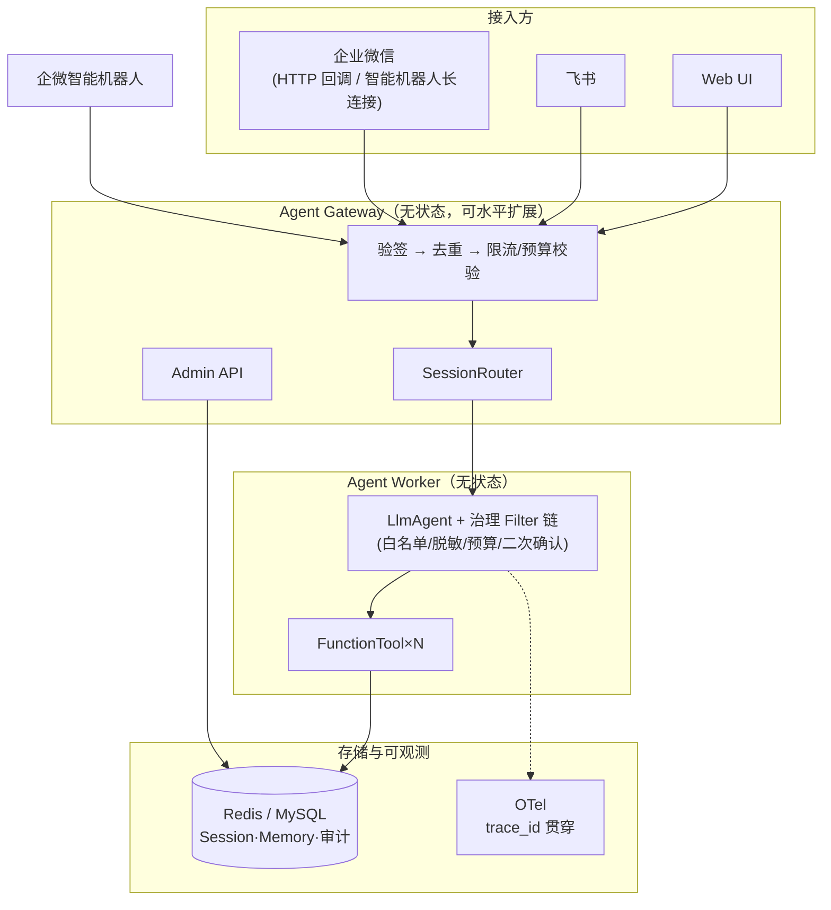
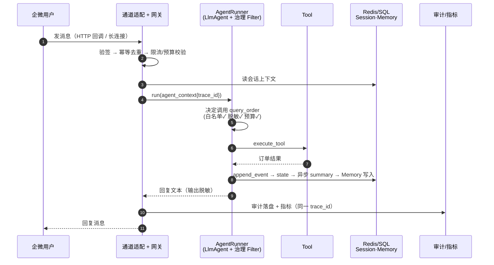

# 作品简介

本作品基于 tRPC-Agent Python 实现了一套面向企业场景的**多租户节点化 Agent 部署平台**。

系统支持多租户配置、可自定义大模型、共享 Session/Memory（Redis/SQL 双后端）、多节点无状态 Worker、飞书和企业微信接入（HTTP 回调 + 智能机器人长连接双形态）、工具治理、审计追踪、故障恢复、灰度发布，以及从本地 Docker Compose 到 Kubernetes 的完整部署方案。

本作品不是单进程聊天机器人，而是一套能够承载多个租户、多个 Agent 应用、多个 IM 入口和多个 Worker 节点的 Agent 服务平台。

## 一、总体架构

## 二、核心时序链路（trace_id 贯穿）

## 三、最终完成内容

- **多租户平台**：租户配置七要素聚合、配置热加载、动态 CRUD、app_name 前缀数据隔离
- **IM 三通道**：飞书事件订阅 v2.0（模拟验证）、企微 HTTP 回调被动回复（模拟验证）、企微智能机器人长连接（**真机验证通过**，免公网域名）
- **治理与安全**：工具白名单/PII 脱敏/预算双层拦截/危险工具二次确认；API-Key 鉴权、CORS 白名单、凭证全部环境变量注入
- **多节点**：Worker 无状态（确定性 session 路由）、inline/Redis 队列双模式（崩溃任务可重放）
- **可观测**：trace_id 贯穿全链路；业务指标（请求量/错误率/耗时/工具耗时/Session 后端延迟/IM 投递成功率/token），进程内聚合 + OTel 双通道
- **数据模型**：平台六表（tenant/agent_app/tenant_revision/audit_log/channel_binding/idempotency）+ 三层幂等
- **运维**：租户配置版本化回滚 + release_stage 灰度发布、审计 JSONL 兜底、Docker Compose/K8s 部署方案

## 四、测试与交付

- 测试：**123 passed + 1 skipped**，覆盖率 77%（协议回环、治理拦截、并发写、容器沙箱、长连接回环）
- 交付物：架构设计文档、架构图、双时序图、数据模型、同步与幂等策略、多后端适配方案、风险清单 12 条（详见 docs/）
